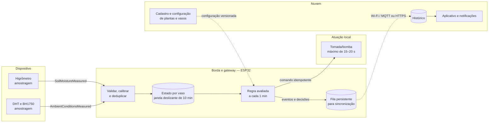

# Atividade 02 — Processamento e distribuição de responsabilidades

**Disciplina:** Software para Sistemas Ubíquos — UFG
**Integrantes:**

- Matheus Vieira Mendes Pacheco
- Davi Duarte Neco
- Bárbara Nogueira

**Cenário:** monitoramento e irrigação automática de plantas domésticas.

## Parte 1 — Eventos do sistema

### 1. Tipos de evento

Para a decisão de irrigar um vaso, serão utilizados dois eventos diferentes:

1. **`SoilMoistureMeasured`**: registra uma medição da umidade do substrato de um vaso.
2. **`AmbientConditionsMeasured`**: registra temperatura, umidade relativa do ar e luminosidade próximas ao vaso.

O primeiro evento representa diretamente a disponibilidade de água no substrato. O segundo representa condições que podem acelerar ou reduzir sua perda. Embora ambos possam ser publicados pelo mesmo ESP32, correspondem a ocorrências e sensores diferentes.

### 2. Contrato dos eventos

#### Evento `SoilMoistureMeasured`

| Elemento | Definição |
|---|---|
| Produtor | ESP32, a partir do higrômetro capacitivo |
| Entidade observada | Substrato do vaso identificado por `potId` |
| Tempo do evento | `eventTime`, instante ISO 8601 com fuso horário em que a amostra foi obtida |
| Identificação | `eventId` único e `sequence` crescente por dispositivo |
| Campos | `eventType`, `eventId`, `deviceId`, `sensorId`, `potId`, `eventTime`, `sequence`, `moisture`, `unit` |
| Unidade | Umidade normalizada em `%` |

#### Evento `AmbientConditionsMeasured`

| Elemento | Definição |
|---|---|
| Produtor | ESP32, a partir dos sensores DHT e BH1750 |
| Entidade observada | Microambiente do vaso identificado por `potId` |
| Tempo do evento | `eventTime`, instante ISO 8601 com fuso horário em que as amostras foram obtidas |
| Identificação | `eventId` único e `sequence` crescente por dispositivo |
| Campos | `eventType`, `eventId`, `deviceId`, `potId`, `eventTime`, `sequence`, `temperature`, `airHumidity`, `illuminance` e respectivas unidades |
| Unidades | Temperatura em `°C`, umidade relativa em `%` e iluminância em `lx` |

### 3. Exemplos válidos

```json
{
  "eventType": "SoilMoistureMeasured",
  "eventId": "esp32-01:1842:soil-01",
  "deviceId": "esp32-01",
  "sensorId": "soil-01",
  "potId": "pot-calanchoe-01",
  "eventTime": "2026-08-28T19:14:32-03:00",
  "sequence": 1842,
  "moisture": 27.4,
  "unit": "%"
}
```

```json
{
  "eventType": "AmbientConditionsMeasured",
  "eventId": "esp32-01:1843:ambient-01",
  "deviceId": "esp32-01",
  "potId": "pot-calanchoe-01",
  "eventTime": "2026-08-28T19:14:35-03:00",
  "sequence": 1843,
  "temperature": 31.2,
  "temperatureUnit": "C",
  "airHumidity": 38.0,
  "airHumidityUnit": "%",
  "illuminance": 18400,
  "illuminanceUnit": "lx"
}
```

### 4. Qualidade dos eventos

Na borda, cada evento passa pelas seguintes verificações:

- **Validade estrutural:** todos os campos obrigatórios devem existir e possuir o tipo esperado.
- **Validade física:** `moisture` e `airHumidity` devem estar entre 0 e 100%, a temperatura entre -10 e 60 °C e a iluminância entre 0 e 150.000 lx. Valores fora desses limites são marcados como inválidos e não entram na janela.
- **Origem:** `deviceId`, `sensorId` e `potId` devem estar cadastrados e associados entre si.
- **Duplicação:** o identificador `eventId` é armazenado durante 24 horas. Um identificador já observado não é processado novamente. A sequência auxilia a detectar repetição, perda e reinício do dispositivo.
- **Atualidade:** para atuação, a última medição do solo não pode ter mais de 2 minutos e a última medição ambiental não pode ter mais de 5 minutos. Dados mais antigos podem ser enviados ao histórico, mas não autorizam a bomba.

Uma leitura isolada com variação superior a 35 pontos percentuais em relação à mediana recente do mesmo sensor é classificada como suspeita. Ela é separada para diagnóstico e a irrigação fica bloqueada até a chegada de uma leitura válida.

## Parte 2 — Processamento temporal

### 5. Operações

O caminho dos eventos é:

```text
receber
  → validar contrato, origem, faixa e identificação
  → eliminar duplicações
  → converter/calibrar a leitura bruta para as unidades do contrato
  → agrupar por potId
  → inserir na janela correspondente ao tempo do evento
  → calcular médias e manter a leitura válida mais recente
  → detectar necessidade de irrigação
  → aplicar limites de segurança e tempo de espera
  → acionar a bomba e registrar a decisão
```

### 6. Estado e janela

A regra utiliza uma **janela deslizante de 10 minutos**, avaliada a cada **1 minuto**. Os eventos são agrupados por `potId`.

O estado mantido para cada vaso contém:

- eventos válidos de umidade do solo dos últimos 10 minutos;
- eventos ambientais válidos dos últimos 10 minutos;
- média da umidade do solo na janela;
- médias de temperatura e umidade do ar;
- configuração vigente da espécie: limite mínimo de umidade do solo e condições de calor/ar seco;
- horário e identificador da última irrigação;
- estado da bomba, duração máxima permitida e período de espera entre irrigações;
- identificadores recentes já processados.

São exigidas pelo menos três medições válidas de umidade do solo na janela. A irrigação é solicitada quando a média estiver abaixo do limite da espécie. Se também houver calor e ar seco, a condição recebe prioridade, mas a duração máxima da bomba não é ultrapassada.

### 7. Semântica temporal

A janela usa o **tempo do evento**, pois deve representar quando a condição ocorreu no ambiente, e não quando o pacote conseguiu chegar ao processador. Isso evita que atraso ou oscilação da rede distorça a sequência das condições observadas.

O tempo de processamento ainda é usado para verificar a idade da leitura, controlar o intervalo entre duas irrigações e impedir uma atuação baseada em um estado que já não representa o momento atual.

### 8. Eventos atrasados

A borda admite atraso de até **30 segundos** antes de fechar cada avaliação. Um evento que pertença à janela, mas chegue depois de o resultado ser produzido, segue a política **separar**:

- não modifica retroativamente uma atuação física já realizada;
- não dispara uma irrigação imediata, pois pode descrever uma condição que já mudou;
- recebe a marca `late: true` e é enviado à nuvem para completar o histórico e permitir diagnóstico da comunicação;
- se seu tempo ainda estiver dentro da janela na próxima avaliação e ele atender aos critérios de atualidade, poderá participar normalmente dessa nova decisão.

Assim, o histórico preserva a leitura sem transformar um dado tardio em comando inseguro.

### 9. Pseudocódigo da regra

```text
A CADA 1 minuto, PARA CADA vaso:
    agora := relógio local sincronizado
    solo := eventos SoilMoistureMeasured válidos
            com eventTime em (agora - 10 minutos, agora]
    ambiente := eventos AmbientConditionsMeasured válidos
                com eventTime em (agora - 10 minutos, agora]

    SE quantidade(solo) < 3:
        publicar alerta "dados de solo insuficientes"
        NÃO irrigar
        CONTINUAR

    SE idade(último(solo), agora) > 2 minutos:
        publicar alerta "sensor de solo desatualizado"
        NÃO irrigar
        CONTINUAR

    SE ambiente estiver vazio
       OU idade(último(ambiente), agora) > 5 minutos:
        publicar alerta "dados ambientais desatualizados"
        NÃO usar prioridade climática

    umidadeMedia := média(solo.moisture)
    limiteSeco := configuraçãoDaEspécie.limiteMinimoSolo
    soloSeco := umidadeMedia < limiteSeco

    calorESeco := ambiente está atual
                  E média(ambiente.temperature) >= configuraçãoDaEspécie.limiteCalor
                  E média(ambiente.airHumidity) <= configuraçãoDaEspécie.limiteArSeco

    esperaCumprida := agora - ultimaIrrigação >= 30 minutos
    seguroParaAtuar := bomba disponível
                       E reservatório possui água
                       E esperaCumprida

    SE soloSeco E seguroParaAtuar:
        duração := calorESeco ? 20 segundos : 15 segundos
        commandId := identificador único(potId, janela, "irrigar")
        ligar bomba por no máximo duração usando commandId
        registrar ultimaIrrigação, duração, medidas e motivo
        publicar evento IrrigationPerformed
    SENÃO SE soloSeco E NÃO seguroParaAtuar:
        publicar alerta com o motivo do bloqueio
    SENÃO:
        manter bomba desligada
```

O `commandId` torna o comando idempotente: uma repetição da mesma decisão não liga novamente a bomba.

## Parte 3 — Distribuição e resiliência

### 10. Distribuição de responsabilidades

Não será utilizada uma camada de névoa neste cenário doméstico, pois há poucos vasos e nenhuma necessidade de coordenar vários locais intermediários.

| Responsabilidade | Local | Estado mantido |
|---|---|---|
| Amostragem, calibração básica e numeração sequencial | Dispositivo/sensores conectados ao ESP32 | Parâmetros de calibração e sequência atual |
| Validação, deduplicação, janela, regra, bloqueios de segurança e atuação | Borda (ESP32) | Janelas de 10 minutos, IDs recentes, configuração da espécie e última irrigação |
| Comunicação entre sensores, rede Wi-Fi e tomada/bomba | Gateway no próprio ESP32 | Fila local de eventos ainda não enviados |
| Cadastro de vasos e espécies, histórico, relatórios, notificações e análise de longo prazo | Nuvem | Perfis, histórico de telemetria, decisões e alertas |
| Aplicação da configuração recebida da nuvem | Borda | Última versão válida da configuração, persistida localmente |

### 11. Justificativas

1. **Regra e atuação na borda:** irrigar é uma função essencial e não deve depender da latência nem da disponibilidade da internet. O ESP32 está próximo aos sensores e ao atuador, consegue tomar a decisão em tempo previsível e pode desligar a bomba pelo limite local mesmo durante uma falha externa.
2. **Histórico e análise na nuvem:** relatórios, comparação entre longos períodos e gerenciamento pelo aplicativo exigem mais armazenamento e uma visão conjunta dos vasos. Essas tarefas toleram atraso e aproveitam melhor a capacidade da nuvem, sem aumentar o risco da atuação imediata.

O mesmo ESP32 exerce os papéis de gateway e nó de borda: encaminha dados entre redes e também mantém estado e executa a regra local.

### 12. Comportamento diante de falha

**Falha escolhida: conexão com a nuvem indisponível.**

Quando perder a conexão, o ESP32 continuará usando a última configuração válida da espécie, armazenada em memória persistente. A janela e a regra de irrigação continuarão locais. Eventos, decisões e alertas serão colocados em uma fila persistente com tamanho limitado e enviados quando a conexão retornar.

Durante a operação offline:

- a bomba continua sujeita à duração máxima e ao intervalo mínimo entre irrigações;
- o aplicativo e a Alexa deixam de receber informações em tempo real;
- alterações de configuração ficam indisponíveis até a reconexão;
- se a configuração local estiver ausente ou corrompida, a irrigação automática é bloqueada e um alerta local é sinalizado;
- após a reconexão, a nuvem elimina duplicações por `eventId` e `commandId`, aceita os eventos para o histórico e não repete atuações antigas.

O serviço, portanto, degrada nas funções remotas, mas preserva localmente a proteção essencial da planta e da bomba.

### 13. Diagrama da distribuição



## Síntese

A solução transforma leituras de solo e ambiente em uma decisão temporal por vaso. A janela reduz a influência de ruídos isolados, os critérios de atualidade evitam atuar com informações antigas e os limites de segurança impedem acionamentos repetidos. A decisão permanece próxima aos sensores e à bomba, enquanto a nuvem concentra funções históricas e de interação com o usuário.
