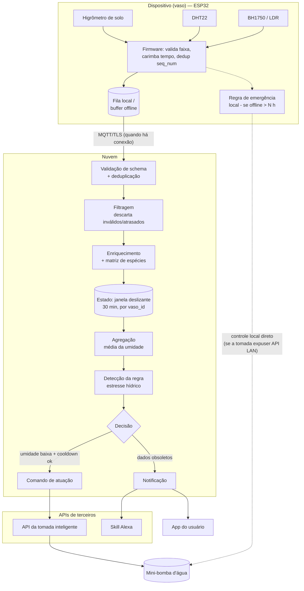

# Software para Sistemas Ubíquos — Atividade em Grupo 02
## Processamento e distribuição de responsabilidades

**Integrantes:**
- Matheus Vieira Mendes Pacheco
- Davi Duarte Neco
- Bárbara Nogueira

**Cenário utilizado:** *Nao de nem agua* — sistema de automação residencial para manutenção do microclima, iluminação e irrigação de plantas de interior, descrito na Atividade 01. Arquitetura de referência: sensores por vaso (higrômetro capacitivo de solo, DHT temperatura/umidade do ar, BH1750/LDR luminosidade) conectados a um gateway ESP32, que envia telemetria via Wi-Fi/MQTT a um backend em nuvem. O backend cruza os dados com uma matriz de requisitos por espécie e aciona tomadas inteligentes (bomba d'água, umidificador) e a Alexa, além de notificar o app do usuário.

---

## Parte 1 — Eventos do sistema

### 1. Tipos de evento

Definimos dois tipos de evento, ambos produzidos pelo mesmo gateway (ESP32) instalado em cada vaso, mas representando ocorrências distintas — uma leitura do **substrato** e uma leitura do **microclima** ao redor da planta:

1. **`LeituraUmidadeSolo`** — leitura periódica do higrômetro capacitivo, referente ao solo/substrato do vaso.
2. **`LeituraAmbiente`** — leitura periódica combinada do DHT (temperatura/umidade do ar) e do sensor de luminosidade, referente ao ar e à luz ao redor do vaso.

Essas duas leituras alimentam a mesma decisão (necessidade de irrigação), mas descrevem fenômenos físicos diferentes e têm taxas/relevância de leitura distintas — por isso são modeladas como eventos separados, não como um único evento "telemetria".

### 2. Contrato dos eventos

| Campo | `LeituraUmidadeSolo` | `LeituraAmbiente` |
|---|---|---|
| **Nome** | LeituraUmidadeSolo | LeituraAmbiente |
| **Produtor** | Gateway ESP32 do vaso (`device_id`), lendo o higrômetro capacitivo | Gateway ESP32 do vaso (`device_id`), lendo DHT22 + BH1750 |
| **Entidade observada** | Substrato/solo do vaso (`vaso_id`) | Microclima ao redor do vaso (`vaso_id`) — ar e luz incidente |
| **Tempo do evento** | Instante da amostragem no ESP32 (relógio sincronizado por NTP) | Instante da amostragem no ESP32 (relógio sincronizado por NTP) |
| **Campos** | `umidade_solo_pct`, `tensao_bruta_mv` | `temperatura_c`, `umidade_ar_pct`, `luminosidade_lux` |
| **Unidade** | % (percentual de saturação calibrado), mV (leitura bruta) | °C, %, lux |
| **Identificação** | `event_id` (UUID) + `seq_num` (contador monotônico por `device_id`) | `event_id` (UUID) + `seq_num` (contador monotônico por `device_id`) |

### 3. Exemplos

```json
{
  "event_type": "LeituraUmidadeSolo",
  "event_id": "a1b2c3d4-5e6f-47a8-9b0c-1d2e3f4a5b6c",
  "seq_num": 4821,
  "device_id": "esp32-vaso-07",
  "vaso_id": "vaso-07",
  "timestamp_evento": "2026-09-11T14:32:05-03:00",
  "umidade_solo_pct": 18.4,
  "tensao_bruta_mv": 2130
}
```

```json
{
  "event_type": "LeituraAmbiente",
  "event_id": "f9e8d7c6-4b3a-4c2d-8e1f-0a9b8c7d6e5f",
  "seq_num": 1207,
  "device_id": "esp32-vaso-07",
  "vaso_id": "vaso-07",
  "timestamp_evento": "2026-09-11T14:32:10-03:00",
  "temperatura_c": 29.8,
  "umidade_ar_pct": 41.2,
  "luminosidade_lux": 8600
}
```

### 4. Qualidade

**Validação de faixa (range check):** `umidade_solo_pct` deve estar em `[0, 100]`; `temperatura_c` em `[-10, 60]`; `umidade_ar_pct` em `[0, 100]`; `luminosidade_lux` em `[0, 130000]`. Um valor fora da faixa indica sensor desconectado, oxidado ou com mau contato e o evento é marcado **inválido** — não entra no pipeline de decisão, mas é registrado para diagnóstico do hardware.

**Duplicado:** cada `device_id` mantém um `seq_num` monotônico. Se o `seq_num` recebido for menor ou igual ao último já processado para aquele `device_id`, o evento é reconhecido como **duplicado** (reenvio por retry do ESP32 após timeout de ACK) e descartado sem reprocessar o estado.

**Desatualizado (stale):** o backend compara `timestamp_evento` com o instante de ingestão. Se a diferença ultrapassar um limiar (2× o intervalo esperado de amostragem, ou o evento chegar após o fechamento da janela à qual pertence), ele é tratado pela política de eventos atrasados do item 8, em vez de ser injetado como leitura corrente.

---

## Parte 2 — Processamento temporal

### 5. Operações

```
LeituraUmidadeSolo / LeituraAmbiente
        │
        ▼
  Validação (schema + faixa)
        │
        ▼
  Deduplicação (seq_num)
        │
        ▼
  Filtragem (descarta inválidos/duplicados; marca atrasados)
        │
        ▼
  Transformação/Enriquecimento (junta vaso_id → espécie → limiares da matriz)
        │
        ▼
  Agrupamento (por vaso_id, em janela deslizante de 30 min)
        │
        ▼
  Agregação (média da umidade do solo na janela; última leitura de ambiente)
        │
        ▼
  Detecção (regra de estresse hídrico)
        │
        ▼
  Decisão
        │
        ▼
  Atuação (comando de irrigação) + Notificação (app / Alexa)
```

### 6. Estado e janela

**Regra:** *Necessidade de irrigação por estresse hídrico*, que depende de leituras anteriores de umidade do solo (uma leitura isolada é ruidosa e não deve, sozinha, acionar a bomba).

- **Tipo de janela:** deslizante (sliding window).
- **Duração:** 30 minutos.
- **Frequência de avaliação:** a cada nova leitura de umidade aceita para o vaso, com um *tick* de segurança a cada 5 minutos caso não cheguem novas leituras (para não deixar a regra "parada" se a taxa de amostragem cair).
- **Estado mantido por `vaso_id`:**
  - buffer/agregado das leituras de `umidade_solo_pct` dentro da janela de 30 min;
  - última `LeituraAmbiente` recebida (temperatura, luz) e seu `timestamp_evento`;
  - `timestamp_ultima_irrigacao` (para aplicar cooldown e evitar acionamentos repetidos).
  - *(Os limiares por espécie não são estado de janela — são dados de referência consultados na matriz de espécies.)*

### 7. Semântica temporal

A regra usa **tempo do evento** (`timestamp_evento`, gerado no ESP32 via NTP), não tempo de processamento.

**Justificativa:** o ESP32 pode enfileirar leituras localmente durante quedas breves de Wi-Fi e reenviá-las em rajada ao reconectar. Se a janela fosse por tempo de processamento, essa rajada distorceria a média (várias leituras "chegando juntas" pareceriam uma queda ou estabilização súbita de umidade que não ocorreu fisicamente naquele instante). Usar tempo do evento preserva a semântica física real de secagem do substrato, que é o que a regra precisa observar.

### 8. Eventos atrasados

Adotamos um **prazo de graça (watermark)** de 10 minutos após o fechamento teórico da janela:

- Evento atrasado que chega **dentro do prazo de graça** → é **aceito e corrige** o agregado: a janela é recalculada e a regra é reavaliada. Se a correção mudar a decisão e a irrigação daquele ciclo **ainda não foi executada**, a nova decisão vale.
- Evento atrasado que chega **após o prazo de graça** → é **separado**: não realimenta a decisão em tempo real (já consolidada), mas é gravado no histórico/auditoria do vaso, para dashboards e para calibrar os limiares no futuro.
- Evento que chegue atrasado depois de a bomba **já ter sido fisicamente acionada** nunca desfaz a atuação (não é possível "retirar" a água) — nesse caso ele só é usado para auditoria e para eventualmente suprimir um novo acionamento redundante no ciclo seguinte.

### 9. Pseudocódigo

```
ESTADO por vaso_id:
    buffer_umidade            // fila com (valor, timestamp_evento), janela deslizante de 30 min
    ultima_leitura_ambiente   // {temperatura_c, luminosidade_lux, timestamp_evento}
    timestamp_ultima_irrigacao // timestamp | null

AO RECEBER evento e:
    SE NAO validar_evento(e):           // schema, faixa, seq_num duplicado
        DESCARTAR e
        RETORNAR

    SE e.timestamp_evento < watermark(e.vaso_id):   // fora do prazo de graça
        ARMAZENAR e em historico_auditoria
        RETORNAR

    SE e.tipo == "LeituraUmidadeSolo":
        inserir (e.umidade_solo_pct, e.timestamp_evento) em buffer_umidade[e.vaso_id]
        remover de buffer_umidade[e.vaso_id] entradas com timestamp_evento fora da janela de 30 min
        avaliar_regra(e.vaso_id)

    SE e.tipo == "LeituraAmbiente":
        ultima_leitura_ambiente[e.vaso_id] = e

FUNCAO avaliar_regra(vaso_id):
    SE tamanho(buffer_umidade[vaso_id]) < 3:
        RETORNAR   // amostras insuficientes na janela

    media_umidade = media(buffer_umidade[vaso_id])
    req = buscar_requisitos_especie(vaso_id)     // limiares de referência, não é estado de janela

    ambiente = ultima_leitura_ambiente[vaso_id]
    dados_frescos = ambiente != null E (agora() - ambiente.timestamp_evento) <= 15min

    cooldown_ok = timestamp_ultima_irrigacao[vaso_id] == null
                  OU (agora() - timestamp_ultima_irrigacao[vaso_id]) >= req.cooldown_min

    SE media_umidade < req.umidade_min E dados_frescos E cooldown_ok:
        duracao = calcular_duracao_pulso(req, media_umidade)
        EMITIR ComandoIrrigacao {
            vaso_id, duracao_seg: duracao,
            motivo: "umidade_abaixo_do_limiar",
            media_umidade, janela_min: 30,
            timestamp: agora()
        }
        timestamp_ultima_irrigacao[vaso_id] = agora()

    SENAO SE media_umidade < req.umidade_min E NAO dados_frescos:
        EMITIR AlertaDadosDesatualizados { vaso_id, motivo: "leitura_ambiente_obsoleta" }
```

---

## Parte 3 — Distribuição e resiliência

### 10. Distribuição de responsabilidades

Usamos apenas dois níveis do contínuo — **dispositivo** e **nuvem** — sem névoa intermediária (ver justificativa no item 11).

| Responsabilidade | Local de execução |
|---|---|
| Leitura dos sensores, carimbo de tempo (NTP) | Dispositivo (ESP32) |
| Validação de faixa e deduplicação básica | Dispositivo (ESP32) |
| Enfileiramento local durante queda de conexão | Dispositivo (ESP32) |
| Regra de emergência mínima (irrigação de segurança) | Dispositivo (ESP32) |
| Validação de schema, deduplicação final | Nuvem |
| Estado da janela deslizante (30 min) por vaso | Nuvem |
| Matriz de requisitos por espécie | Nuvem |
| Detecção da regra e decisão de irrigação | Nuvem |
| Orquestração das APIs de terceiros (tomada, Alexa) | Nuvem |
| Notificação ao usuário / histórico / auditoria | Nuvem |

### 11. Justificativas

**a) Validação de faixa e deduplicação no dispositivo (ESP32).**
Critérios: **energia** e **volume de dados**. O rádio Wi-Fi é o maior consumidor de energia do ESP32; descartar leituras fisicamente impossíveis (sensor desconectado, mau contato) antes de transmitir evita rajadas de tráfego inúteis e economiza energia e banda — sem custo de rodar isso na borda, já que é um teste de limite trivial (comparação numérica).

**b) Estado da janela, matriz de espécies e decisão final na nuvem.**
Critérios: **capacidade** e **necessidade de visão global**. O ESP32 tem RAM/flash limitados para manter buffers de múltiplos vasos e a matriz completa de espécies. Além disso, a decisão cruza dados de diferentes sensores (umidade, luz, temperatura) e depende de acionar APIs externas (tomada inteligente, Alexa) que só são alcançáveis pela internet — informação e capacidade que só existem de forma centralizada na nuvem.

### 12. Comportamento diante de falhas

**Falha escolhida:** conexão com a nuvem indisponível (Wi-Fi local funcionando, mas backend/internet fora do ar) — o risco principal já identificado na Atividade 01.

**Comportamento do sistema:**
1. O ESP32 continua amostrando os sensores normalmente e enfileira os eventos localmente (buffer persistente em flash), preservando o `timestamp_evento` original.
2. Tenta reconectar e reenviar periodicamente (retry com backoff).
3. Como o acionamento da bomba depende, na arquitetura da Atividade 01, de uma API de tomada inteligente de terceiro só acessível via nuvem, **a irrigação automática por regra completa (com limiares por espécie) fica indisponível durante a queda** — essa é a degradação assumida.
4. **Rede de segurança local:** o ESP32 aplica uma regra de emergência mínima e conservadora, independente da nuvem: se `umidade_solo_pct` ficar abaixo de um limiar crítico fixo (ex.: 10%, mais restritivo que qualquer espécie cadastrada) **e** a conexão estiver indisponível há mais de *N* horas, aciona um pulso curto e limitado de irrigação. Isso só é possível se a tomada inteligente também expuser uma API local (ex.: firmware Tasmota/ESPHome com HTTP no LAN); com uma tomada 100% dependente da nuvem do fabricante, essa rede de segurança não existe e o sistema apenas registra e alerta — ponto que recomendamos revisitar na escolha do atuador.
5. Ao reconectar, o ESP32 reenvia a fila de eventos pendentes (tratados como atrasados conforme item 8) e o backend dispara uma notificação resumindo o período offline e eventuais ações de emergência tomadas.

### 13. Diagrama


