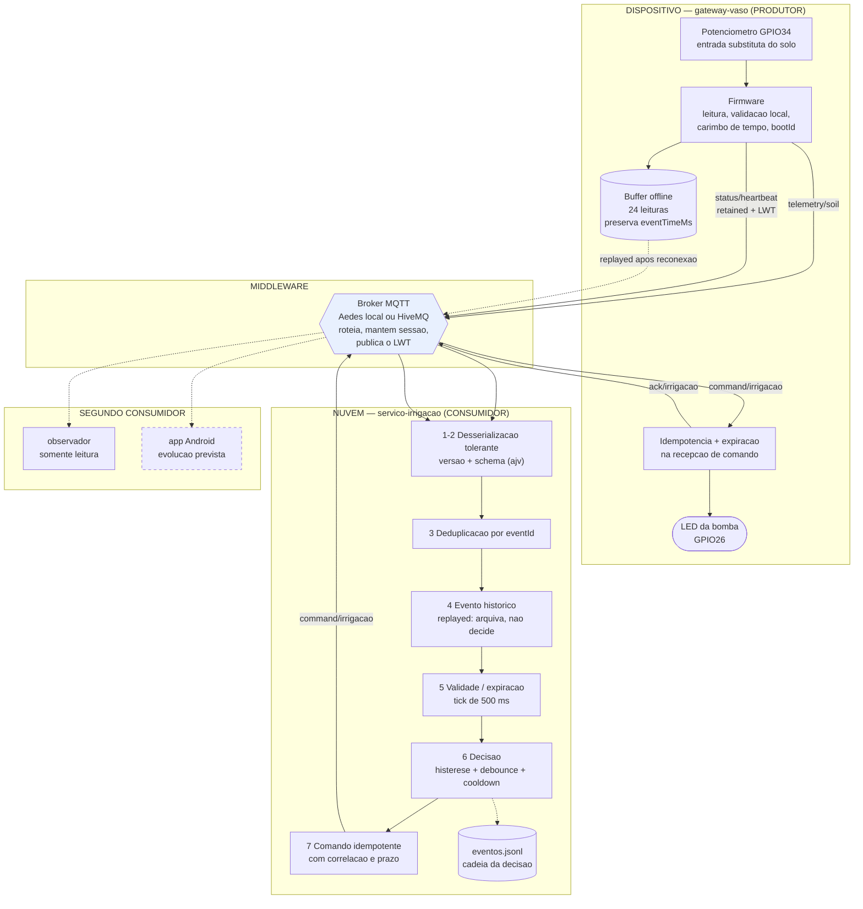

# Diagrama de componentes

Esboço arquitetural da fronteira do Marco 2. Cada caixa é um processo
executável; cada seta é uma publicação ou assinatura MQTT.

O app Android aparece tracejado porque **não é entrega deste marco**. Ele está
no diagrama para deixar visível a razão de ter sido escolhido um mecanismo de
publicação e assinatura: acrescentá-lo é acrescentar um assinante, sem tocar no
produtor nem no serviço. O `observador` ocupa hoje exatamente esse lugar e prova
a afirmação ao vivo.
