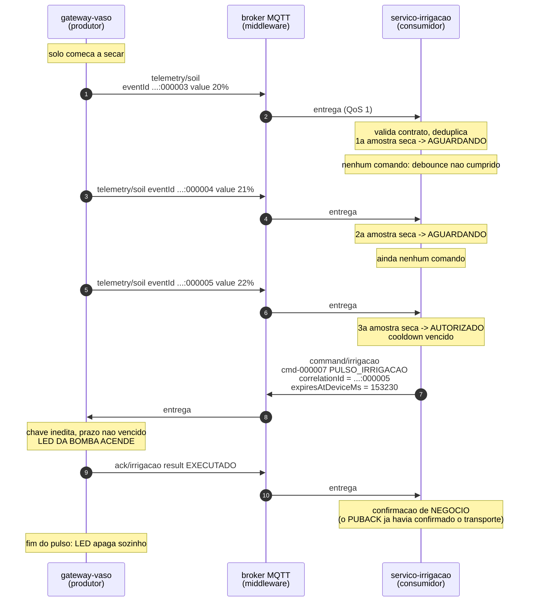
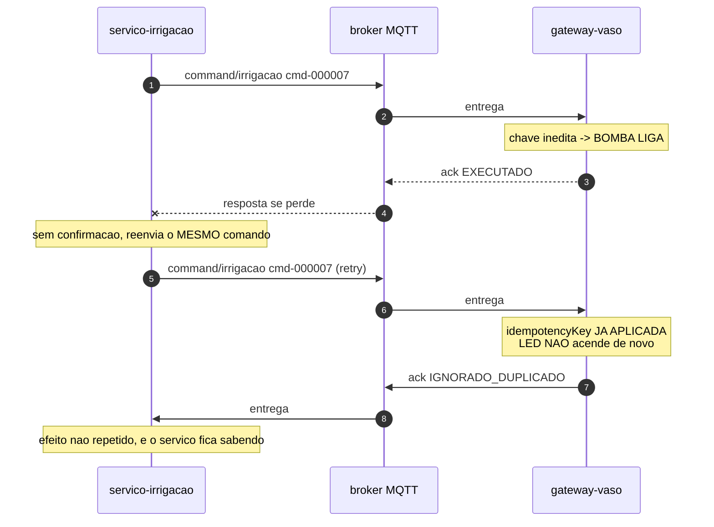
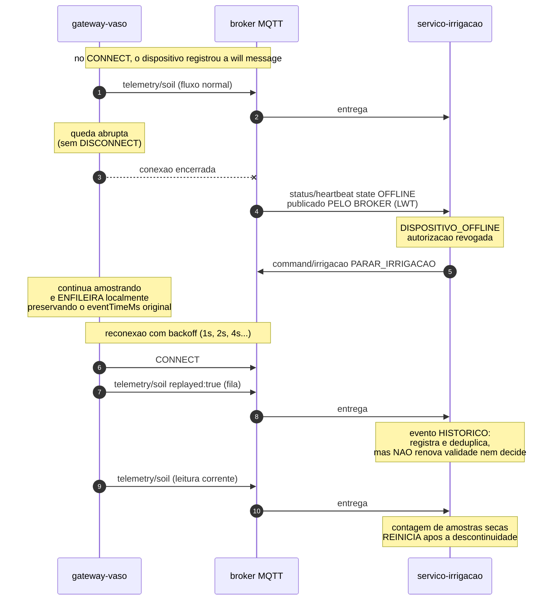
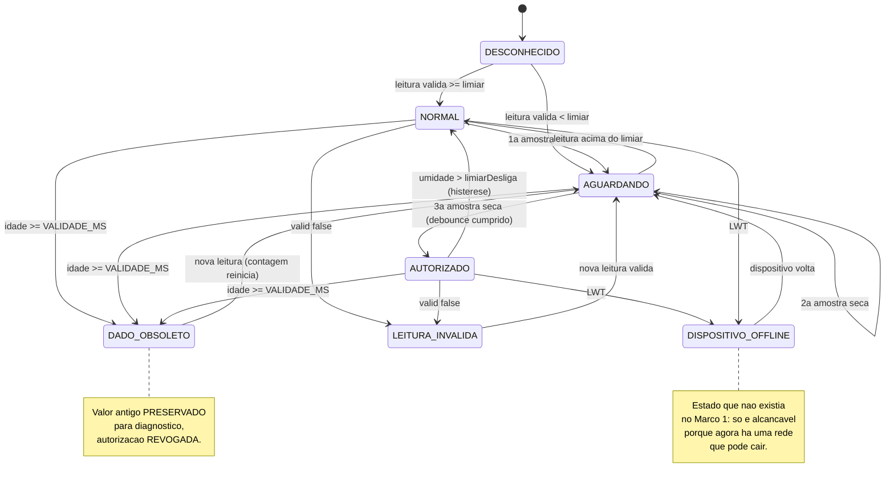

# Diagramas de sequência

## 1. Caminho feliz — da leitura à atuação

Mostra o percurso completo de um evento identificado até o efeito observável,
incluindo por que as duas primeiras amostras secas **não** atuam.

## 2. Falha F2 — retry de comando

O caso do slide 24: a resposta se perde e o cliente repete. Sem chave
idempotente, o vaso receberia água duas vezes.

## 3. Falha F1 — queda abrupta e recuperação

Duas proteções agem aqui, e por motivos diferentes: o LWT avisa depressa, mas só
existe se a conexão cair; a expiração por tempo funciona sempre, inclusive se o
dispositivo continuar conectado e apenas parar de medir.

## 4. Estados do consumidor

Os quatro estados de falha — `DESCONHECIDO`, `DADO_OBSOLETO`,
`LEITURA_INVALIDA` e `DISPOSITIVO_OFFLINE` — têm o mesmo efeito sobre a atuação:
nenhuma irrigação é autorizada, e uma irrigação em curso é interrompida.
